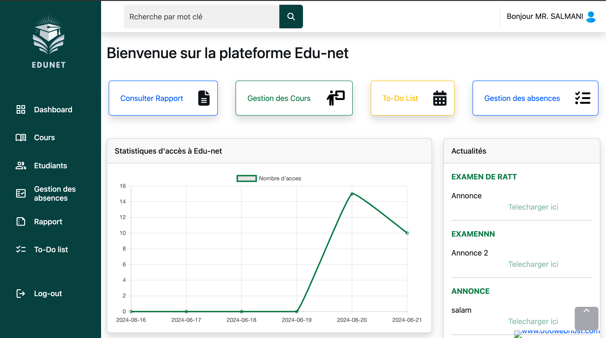

# Edu-net: University management web App
## Table of Contents

1. [Project Overview](#project-overview)
2. [Technologies Used](#technologies-used)
3. [Project Details](#project-details)
    - [Part 1: Login Page](#part-1-Login-Interface)
    - [Part 2: Admin interface](#part-2-Admin-interface)
    - [Part 3: Professors Interface](#part-3-Professors-Interface)
    - [Part 4: Student Interface](#part-4-Student-Interface)
4. [Architecture](#Architecture)
7. [Demo Video](#demo-video)
8. [Conclusion](#conclusion)
9. [Contacts](#contacts)

## Project Overview

Edu-net is a comprehensive university management web application designed to streamline and manage academic activities efficiently. The primary goal is to provide a user-friendly platform for administrators, professors, and students to handle academic tasks such as publishing grades, managing accounts, tracking attendance, and more.

## Technologies Used

- **PHP**
- **HTML/CSS, Bootstrap**
- **MySql**
- **JavaScript, ChartJS**
- **AJAX (light utility)**
- **jQuery (light utility)**
- **Design pattern MVC**

## Project Details

### Part 1: Login Interface

### Part 2: Admin interface

the Admin space provides a lot of features such as:

- **Adding Students:** Upload student data via an Excel file, with options to activate or deactivate accounts.
- **Adding Professors:** Adding professors, with options to activate or deactivate accounts.
- **Publishing Announcements:** Admins can post announcements either for a specific major or for all students in the university.
- **Publishing Grades:** Upload grades from an Excel file containing student CNE and grades.
- **Tracking Users:** Monitor and track user activity on the platform

the user tracking provides several information such as: 

- the ip adress fro where the user is connected
- the user CNE or CIN (depends if it's a student or a professor)
- the date and hour of the action 
- the criticality (info or error)
- the action happened

### Part 3: Professors Interface

the Professor space provides several features such as : 

- **Publishing Courses/TD/TP:** For scalable and flexible data storage.
- **Archiving/Desarchiving Courses:** Professors can archive or restore course materials.
- **Managing Absences:** Record student absences and consult absence details (date, hour, type of session).
- **Publishing Assignments:** Post assignments for students to complete.
- **To-Do List:** Professors can add, modify, delete, and mark tasks as complete.
- **Consulting and Downloading Assignments:** Review and download assignments submitted by students.

### Part 4: Student Interface

the Student space provides several features such as : 

- **Check Grades:** View their published grades.
- **Check and Consult Announcements:** Stay updated with important announcements from administrators.
- **Submit Assignments:** Submit assignments for evaluation. Each assignment can only be submitted once.
- **Download Un-archived Courses/TD/TP:** Access and download course materials, tutorials, and practical work that have not been archived by professors.

## Architecture

The application follows the MVC design pattern:

1. **Model:** Manages data and business logic.
2. **View:** Handles the presentation layer and UI.
3. **Controller:** Processes user inputs and interacts with the model to update the view.

## Demo Video

Watch our demo video to see the Edu-net application in action:

https://github.com/allaliamine/web_Project/assets/155643939/af4bfa72-b27c-4938-ab99-fda06b0fb01a

## Conclusion

The Edu-net project demonstrates the potential of leveraging web technologies to manage and streamline academic activities within a university. By providing a comprehensive platform for grade publication, account management, attendance tracking, and more, Edu-net aims to enhance the efficiency and effectiveness of academic administration.

## Contacts

For any inquiries or feedback, please contact:
-  
-  
-  
-  
